<div align="center">

# 🚨 AstrBot 灾害预警插件

# Disaster Warning Plugin for AstrBot

</div>

<p align="center">
  
  
</p>

<p align="center">
  
  
  
</p>

[](https://github.com/DBJD-CR/astrbot_plugin_disaster_warning)


---

  一个为 [AstrBot](https://github.com/AstrBotDevs/AstrBot) 设计的，功能强大的多数据源灾害预警插件，它能让你的 Bot 提供实时的地震、海啸、气象预警信息推送服务。

## 📑 快速导航

<div align="center">

| 🧭 章节 | ℹ️ 内容 |
|---------|---------|
| [✨ 功能特性](#-功能特性) | 多数据源支持与智能推送 |
| [🚀 安装与使用](#-安装与使用) | 安装步骤与配置示例 |
| [📊 推送示例](#-推送示例) | 地震/海啸/气象预警推送示例 |
| [📋 使用命令](#-使用命令) | 所有可用命令与示例 |
| [🏗️ 系统架构](#system-architecture) | 完整架构图与详细说明 |
| [⚙️ 架构细节](#architecture-details) | 配置参数与技术细节 |
| [🔧 调试功能](#-调试功能) | 日志记录与消息过滤 |
| [🔧 故障排除](#-故障排除) | 常见问题与解决方案 |
| [🚧 已知限制](#-最新版本的已知限制) | 当前版本的技术限制 |

</div>

---


<!-- 开发者的话 -->
> **开发者的话：**
>
> 大家好，我是 DBJD-CR ，这是我为 AstrBot 开发的第二个插件，如果存在做的不好的地方还请理解。
>
> 写这个插件主要还是因为我自己的一点业余爱好吧，而且也比较符合我们"应急管理大学"的特色（）
>
> 虽然一开始也没抱太大希望，但没想到最终还真的搓出了个像模像样的插件，尽管目前还有很多缺陷，但已经能实现90%的基本功能了。
>
> 和[主动消息插件](https://github.com/DBJD-CR/astrbot_plugin_proactive_chat)一样，本插件也是"Vibe Coding"的产物。
>
> 所以，**本插件的所有文件内容，全部由 AI 编写完成**，我几乎没有为该插件编写任何一行代码，仅修改了一些文字描述和负责本文档的润色。所以，或许有必要添加下方的声明：

> [!WARNING]  
> 本插件和文档由 AI 生成，内容仅供参考，请仔细甄别。

> 当然，这次的开发过程也没顺利到哪去。尽管用上了新的工作流，提高了很多效率。但是开发过程中还是遇到了相当多的 Bug，调试起来花了很多时间。
>
> 最终，经过了几十次甚至上百次 debug，我们才终于开发出一个较为稳定的版本。
>
> 但我还是要感谢 AI ，没有他，这个项目不可能完成。
>
> 这个插件，是我们共同努力的结晶。它现在还不完美，但它的架构是稳固的，它的逻辑是清晰的（大嘘）。希望本插件能为你在防灾上提供一点小小的帮助。
>
> 在此，我也诚邀各路大佬对本插件进行测试和改进。因为说实话我也不知道这个插件目前的水平如何，希望大家多多指点。
>
> KIMI：如果你被这个"为爱发电"的故事打动了，或者觉得这个插件很实用，**欢迎你为这个插件点个** 🌟 **Star** 🌟，这是对我们的最大认可与鼓励~

> [!NOTE]
> 虽然本插件的开发过程中大量使用了 AI 进行辅助，但我保证所有内容都经过了我的严格审查，所有的 AI 生成声明都是形式上的。你可以放心参观本仓库和使用本插件。
>
> 根据我对 v1.0.0 版本的简单测试，目前插件的主要功能都能正常运转。但存在部分限制（详情请看 🚧 最新版本的已知限制 部分）。

> [!TIP]
> 本项目的相关开发数据 (持续更新中)：
>
> 开发时长：累计 5 天（主插件部分）
>
> 累计工时：约 34 小时（主插件部分）
>
> 使用的大模型：Kimi For Coding (With RooCode in VSCode)
>
> 对话窗口搭建：VSCode RooCode 扩展
>
> Tokens Used：155,491,730

## ✨ 功能特性

### 🌍 多数据源支持

- **中国地震网地震预警** - 实时地震预警信息。
- **台湾中央气象署强震即时警报** - 台湾地区地震预警。
- **日本气象厅紧急地震速报** - 日本紧急地震速报。
- **中国地震台网地震测定** - 正式地震测定信息。
- **日本气象厅地震情报** - 详细地震情报。
- **USGS地震测定** - 美国地质调查局地震信息。
- **Global Quake服务器** - 全球地震测站实时计算推送，精度有限。
- **中国气象局气象预警** - 气象灾害预警。
- **自然资源部海啸预警中心** - 海啸预警信息。

### 🎯 智能推送控制

- **阈值过滤** - 根据震级、烈度、震度设置推送阈值。
- **省份白名单** - 可选的省份白名单过滤，只推送指定省份的预警消息。
- **频率控制** - 可选的基于报数的智能推送，避免短时间内刷屏。
- **首报推送保证** - 确保预警信息首次下达时总是推送。
- **最终报保证** - 确保最终报总是推送。

### 🔁 事件去重功能

插件具备基础的事件去重功能，防止同一地震被多个数据源重复推送：

**去重规则**：

- **时间窗口**：1 分钟内接收到的相似事件视为同一事件。
- **位置容差**：经纬度差异在 20 公里内视为同一事件。
- **震级容差**：震级差异在 0.5 级内视为同一事件。
- **优先原则**：只推送最先接收到的数据源。

**配置参数**（当前为固定值）：

- 时间窗口：1 分钟。
- 位置容差：20 公里。
- 震级容差：0.5 级。

### 📱 灵活配置

- **WebUI配置** - 通过 AstrBot WebUI 界面进行配置。
- **多群推送** - 支持配置特定 QQ 群接收预警（留空则不推送）。
- **专门格式化** - 统一的消息格式，确保信息完整。
- **数据源选择** - 自由选择启用的 19 个细粒度数据源。

## 🚀 安装与使用

1. **下载插件**: 通过 AstrBot 的插件市场下载。或从本 GitHub 仓库的 Release 下载 `astrbot_plugin_disaster_warning` 的 `.zip` 文件，在 AstrBot WebUI 中的插件页面中选择 `从文件安装` 。
2. **安装依赖**: 本插件的核心依赖大多已包含在 AstrBot 的默认依赖中，通常无需额外安装。如果你的环境中缺少以下依赖，请安装：

   ```bash
   pip install python-dateutil asyncio-mqtt
   ```

3. **重启 AstrBot (可选)**: 如果插件没有正常加载或生效，可以尝试重启你的 AstrBot 程序。
4. **配置插件**: 进入 WebUI，找到 `astrbot_plugin_disaster_warning` 插件，选择 `插件配置` 选项，配置相关参数。

### 阈值设置示例

```text
最小震级: 2.0        # 低于M2.0的地震不推送
最小烈度: 4.0        # 低于烈度4度的地震不推送  
最小震度: 1.0        # 低于震度1的地震不推送
```

### 省份白名单过滤

插件支持分别为地震/海啸和气象预警配置省份白名单：

```text
地震/海啸白名单: ["四川", "云南", "西藏"]  # 仅推送这些省份的地震和海啸预警
气象预警白名单: ["广东", "浙江", "江苏"]  # 仅推送这些省份的气象预警
留空则不过滤                             # 推送所有省份
```

**工作原理**：

- **地震预警**：从 `province` 字段或 `place_name` 字段中提取省份信息
- **气象预警**：从 `headline` 或 `title` 字段中提取省份信息
- **模糊匹配**：支持省份名称的模糊匹配（例如："四川"可以匹配"四川省"）
- **严格过滤**：白名单启用时，无法识别省份的事件（如国外地震）将被过滤

**使用场景**：

- 只关注特定地区的灾害预警
- 减少不相关地区的推送信息
- 地震和气象可分别配置不同的关注省份
- 自动过滤国外地震和海啸信息

**注意事项**：

- 白名单仅对包含省份信息的预警有效
- 地震/海啸和气象预警使用不同的白名单
- 白名单启用时，无法提取省份信息的事件将被过滤（如国外地震）
- 配置为空列表时，不进行省份过滤

### 推送频率控制示例

```text
每收到N报推送一次: 1    # 每1报推送一次
最终报是否总是推送: true  # 最终报必定推送
是否忽略非最终报: false   # 不忽略中间报
```

## 📊 推送示例

### 地震预警推送示例

**中国地震台网正式测定示例**：

```text
🚨【中国地震台网】
📍震中：新疆和田地区皮山县
⏰时间：2025-12-02 19:45:32 (UTC+8)
📊震级：M 3.6
🏔️深度：93 km
💥烈度：3.0
📋信息类型：中国地震台网 [正式测定]
🗺️地图: ......
```

**中国地震预警网示例**：

```text
🚨【中国地震预警网】
📍震中：新疆克孜勒苏州阿合奇县
⏰时间：2025-12-04 15:44:05 (UTC+8)
📊震级：M 6.0
🏔️深度：10 km
💥烈度：7.8
🔄报数：第 3 报
🔚最终报：是
📋信息类型：中国地震预警网
🗺️地图: ......
```

**USGS地震情报示例**：

```text
🚨【USGS 地震情报】
📍震中：46 km NNW of San Antonio, Puerto Rico
⏰时间：2025-12-04 11:57:06 (UTC+8)
📊震级：M 3.2
🏔️深度：46.2 km
💥烈度：无
📋信息类型：USGS地震情报 [人工复核]
🗺️地图: ......
```

**P2P地震情報示例**：

```text
🚨【P2P地震情報】
📍震中：十勝地方中部
⏰时间：2025/12/04 18:04:00 (UTC+9)
📊震级：M 3.6
🏔️深度：50 km
💥震度：2
🔄报数：第 1 报
🔚最终报：否
📋信息类型：日本气象厅 [詳細震度]
🗺️地图: ......
```

### 海啸预警推送示例

```text
🌊【海啸预警】
📋海啸黄色警报
⚠️级别：黄色
🏢发布：自然资源部海啸预警中心
⏰发布时间：2025-07-15 23:30:15 (UTC+8)
🌍震源：台湾花莲东部海域
📍台湾花莲 预计23:45到达 波高50-100cm
📍台东成功 预计00:15到达 波高30-80cm
  ...等5个预报区域
📊监测数据：
  •花莲港 波高45cm 23:25
  •台东港 波高38cm 23:28
🔄事件编号：TS2025071501
```

### 气象预警推送示例

```text
⛈️【气象预警】
📋广东省阳江市发布暴雨橙色预警信号
📝【阳江分镇暴雨红色预警降级为橙色】过去3小时，我市中北部出现强降水，预计强降水仍将持续，阳江市气象台于2025年4月25日12时37分将阳江分镇暴雨红色预警信号降级为橙色，请继续做好防御工作。
⏰生效：2025-04-25 12:37 (UTC+8)
```

## 📋 使用命令

插件提供以下命令：

| 命令 | 描述 |
|------|------|
| `/灾害预警` | 显示插件帮助信息 |
| `/灾害预警状态` | 查看服务运行状态 |
| `/灾害预警测试 [群号] [灾害类型]` | 测试推送功能 |
| `/灾害预警统计` | 查看推送统计信息 |
| `/灾害预警配置 查看` | 查看当前配置摘要 |
| `/灾害预警去重统计` | 查看事件去重统计信息 |
| `/灾害预警日志` | 查看原始消息日志统计 |
| `/灾害预警日志开关` | 开关原始消息日志记录 |
| `/灾害预警日志清除` | 清除所有原始消息日志 |
| `/灾害预警地震白名单 查看` | 查看地震/海啸省份白名单 |
| `/灾害预警地震白名单 添加 [省份]` | 添加省份到地震/海啸白名单 |
| `/灾害预警地震白名单 删除 [省份]` | 从地震/海啸白名单删除省份 |
| `/灾害预警地震白名单 清空` | 清空地震/海啸白名单 |
| `/灾害预警气象白名单 查看` | 查看气象预警省份白名单 |
| `/灾害预警气象白名单 添加 [省份]` | 添加省份到气象白名单 |
| `/灾害预警气象白名单 删除 [省份]` | 从气象白名单删除省份 |
| `/灾害预警气象白名单 清空` | 清空气象白名单 |

### 命令示例

```bash
# 查看服务状态
/灾害预警状态

# 测试推送到当前群（默认地震预警）
/灾害预警测试

# 测试推送到当前群（指定灾害类型）
/灾害预警测试 earthquake     # 测试地震预警
/灾害预警测试 tsunami        # 测试海啸预警
/灾害预警测试 weather        # 测试气象预警

# 测试推送到指定群（默认地震预警）
/灾害预警测试 123456789

# 测试推送到指定群（指定灾害类型）
/灾害预警测试 123456789 earthquake  # 在群123456789测试地震预警
/灾害预警测试 123456789 tsunami     # 在群123456789测试海啸预警
/灾害预警测试 123456789 weather     # 在群123456789测试气象预警

# 查看统计信息
/灾害预警统计

# 地震/海啸白名单管理
/灾害预警地震白名单 查看              # 查看当前地震白名单
/灾害预警地震白名单 添加 四川          # 添加四川到地震白名单
/灾害预警地震白名单 添加 云南          # 添加云南到地震白名单
/灾害预警地震白名单 删除 四川          # 从地震白名单删除四川
/灾害预警地震白名单 清空              # 清空整个地震白名单

# 气象预警白名单管理
/灾害预警气象白名单 查看              # 查看当前气象白名单
/灾害预警气象白名单 添加 广东          # 添加广东到气象白名单
/灾害预警气象白名单 添加 浙江          # 添加浙江到气象白名单
/灾害预警气象白名单 删除 广东          # 从气象白名单删除广东
/灾害预警气象白名单 清空              # 清空整个气象白名单
```

---

## 📂 插件目录与结构

目录结构示例：

```bash
AstrBot/
└─ data/
   └─ plugins/
      └─ astrbot_plugin_disaster_warning/
         ├─ __init__.py                    # Python包初始化文件，支持相对导入
         ├─ _conf_schema.json              # WebUI配置界面schema定义
         ├─ main.py                        # 插件主入口文件，包含命令处理
         ├─ metadata.yaml                  # 插件元数据信息
         ├─ README.md                      # 插件说明文档
         ├─ requirements.txt               # 插件依赖列表
         ├─ models.py                      # 数据模型定义（地震、海啸、气象等）
         ├─ disaster_service.py            # 核心灾害预警服务
         ├─ websocket_manager.py           # WebSocket连接管理器
         ├─ data_handlers.py               # 各数据源消息处理器
         ├─ message_manager.py             # 消息推送管理器
         ├─ message_logger.py              # 原始消息记录器
         ├─ event_deduplicator.py          # 事件去重器
         ├─ logo.png                       # 插件Logo，适用于AstrBot v4.5.0+
         └─ LICENSE                        # 许可证文件
```

插件运行时会自动创建数据存储目录：

```bash
AstrBot/
└─ data/
   └─ plugin_data/
      └─ astrbot_plugin_disaster_warning/
         ├─ raw_messages.log               # 原始消息日志文件（启用时）
         ├─ raw_messages.log.1             # 轮转日志文件（自动管理）
         └─ raw_messages.log.2             # 更多轮转文件...
```

---

## <span id="system-architecture">🏗️ 系统架构</span>

### 📊 架构图

```mermaid
graph TB
    %% 定义样式
    classDef plugin fill:#e1f5fe,stroke:#01579b,stroke-width:2px,color:#000
    classDef service fill:#f3e5f5,stroke:#4a148c,stroke-width:2px,color:#000
    classDef manager fill:#e8f5e8,stroke:#1b5e20,stroke-width:2px,color:#000
    classDef handler fill:#fff3e0,stroke:#e65100,stroke-width:2px,color:#000
    classDef data fill:#fce4ec,stroke:#880e4f,stroke-width:2px,color:#000
    classDef external fill:#ffebee,stroke:#b71c1c,stroke-width:2px,color:#000
    classDef config fill:#fafafa,stroke:#424242,stroke-width:1px,color:#000

    %% 主插件层
    subgraph "AstrBot 插件层"
        MAIN["🚀 DisasterWarningPlugin<br/>主插件入口"]
        CMD["📋 命令处理器<br/>灾害预警状态/测试/配置"]
    end

    %% 核心服务层
    subgraph "🎯 核心服务层"
        SVC["⚡ DisasterWarningService<br/>灾害预警核心服务"]
        
        subgraph "连接管理"
            WS["🌐 WebSocketManager<br/>WebSocket连接管理"]
            HTTP["🌐 HTTPDataFetcher<br/>HTTP数据获取"]
            TCP["🌐 GlobalQuakeClient<br/>TCP客户端"]
        end
        
        subgraph "数据处理"
            HANDLERS["🔧 数据处理器工厂<br/>FanStudio/P2P/Wolfx/GlobalQuake"]
            FAN["🏭 FanStudioHandler<br/>FAN Studio数据处理"]
            P2P["📡 P2PDataHandler<br/>P2P地震情報处理"]
            WOLF["🐺 WolfxDataHandler<br/>Wolfx数据处理"]
            GQ["🌍 GlobalQuakeHandler<br/>Global Quake处理"]
        end
    end

    %% 消息管理层
    subgraph "📢 消息管理层"
        MM["📊 MessagePushManager<br/>消息推送管理器"]
        MF["📝 MessageFormatter<br/>专门消息格式化器"]
        DEDUP["🔄 EventDeduplicator<br/>事件去重器"]
        
        subgraph "推送控制"
            THRESHOLD["📊 阈值检查<br/>震级/烈度/震度"]
            FREQ["⏱️ 频率控制<br/>报数控制/最终报保证"]
            TIME["⏰ 时间检查<br/>1小时时效限制"]
        end
    end

    %% 日志记录层
    subgraph "📝 日志记录层"
        LOGGER["📋 MessageLogger<br/>原始消息记录器"]
        FILTER["🎯 智能消息过滤<br/>心跳包/P2P状态/重复事件"]
        FORMAT["✨ 可读性格式化<br/>JSON→中文格式化"]
    end

    %% 数据模型层
    subgraph "📊 数据模型层"
        MODELS["🏗️ 统一数据模型"]
        EQ["🌍 EarthquakeData<br/>地震数据"]
        TSU["🌊 TsunamiData<br/>海啸数据"]
        WEATHER["⛅ WeatherAlarmData<br/>气象预警数据"]
        EVENT["⚡ DisasterEvent<br/>统一灾害事件"]
    end

    %% 外部数据源
    subgraph "🌐 外部数据源"
        FAN_API["🌐 FAN Studio API<br/>wss://ws.fanstudio.tech"]
        P2P_API["🌐 P2P地震情報<br/>wss://api.p2pquake.net"]
        WOLF_API["🌐 Wolfx API<br/>wss://ws-api.wolfx.jp"]
        GQ_SERVER["🌐 Global Quake<br/>server-backup.globalquake.net:38000"]
        HTTP_API["🌐 HTTP API<br/>api.wolfx.jp/cenc_eqlist.json"]
    end

    %% 目标输出
    subgraph "🎯 目标输出"
        ASTRBOT["🤖 AstrBot消息平台"]
        GROUPS["👥 QQ群/目标会话"]
        LOGS["📄 日志文件<br/>raw_messages.log"]
    end

    %% 连接关系
    MAIN --> SVC
    CMD --> MAIN
    
    SVC --> WS
    SVC --> HTTP
    SVC --> TCP
    SVC --> MM
    SVC --> LOGGER
    
    WS --> HANDLERS
    HTTP --> HANDLERS
    TCP --> HANDLERS
    
    HANDLERS --> FAN
    HANDLERS --> P2P
    HANDLERS --> WOLF
    HANDLERS --> GQ
    
    FAN --> MODELS
    P2P --> MODELS
    WOLF --> MODELS
    GQ --> MODELS
    
    MODELS --> EQ
    MODELS --> TSU
    MODELS --> WEATHER
    MODELS --> EVENT
    
    MM --> MF
    MM --> DEDUP
    MM --> THRESHOLD
    MM --> FREQ
    MM --> TIME
    
    LOGGER --> FILTER
    LOGGER --> FORMAT
    LOGGER --> LOGS
    
    FAN --> FAN_API
    P2P --> P2P_API
    WOLF --> WOLF_API
    GQ --> GQ_SERVER
    HTTP --> HTTP_API
    
    MM --> ASTRBOT
    ASTRBOT --> GROUPS

    %% 数据流
    FAN_API -.->|WebSocket数据| FAN
    P2P_API -.->|WebSocket数据| P2P
    WOLF_API -.->|WebSocket数据| WOLF
    GQ_SERVER -.->|TCP数据| GQ
    HTTP_API -.->|HTTP数据| HTTP
    
    FAN -.->|DisasterEvent| MM
    P2P -.->|DisasterEvent| MM
    WOLF -.->|DisasterEvent| MM
    GQ -.->|DisasterEvent| MM
    
    MM -.->|MessageChain| ASTRBOT
    LOGGER -.->|格式化日志| LOGS

    %% 应用样式
    class MAIN,CMD plugin
    class SVC,WS,HTTP,TCP service
    class MM,MF,DEDUP,THRESHOLD,FREQ,TIME manager
    class HANDLERS,FAN,P2P,WOLF,GQ handler
    class MODELS,EQ,TSU,WEATHER,EVENT data
    class FAN_API,P2P_API,WOLF_API,GQ_SERVER,HTTP_API external
    class ASTRBOT,GROUPS,LOGS config
```



### 📋 架构特点

#### 🎯 分层设计

- **插件层**: AstrBot插件主入口，处理用户命令
- **服务层**: 核心灾害预警服务，协调各组件
- **管理层**: 消息推送管理，包含智能控制逻辑
- **数据层**: 统一数据模型，确保数据一致性
- **日志层**: 完整的日志记录和格式化系统

#### 🌐 多数据源支持

- **WebSocket连接**: FAN Studio、P2P、Wolfx实时数据流
- **HTTP轮询**: Wolfx地震列表定时获取
- **TCP连接**: Global Quake服务器（当前状态未知）

#### 🔧 智能数据处理

- **专门格式化器**: 每种数据源都有对应的处理器
- **统一数据模型**: 所有数据转换为标准`DisasterEvent`格式
- **智能识别**: 自动识别地震、海啸、气象等不同类型事件

#### 📢 消息推送控制

- **阈值检查**: 震级、烈度、震度多重过滤
- **频率控制**: 报数控制，避免刷屏
- **事件去重**: 1分钟窗口，20km位置容差
- **时间限制**: 1小时时效性检查
- **首报与最终报保证**: 确保重要信息必达

#### 📝 完整日志系统

- **原始消息记录**: 保留所有数据源原始格式
- **智能过滤**: 自动过滤心跳包、重复事件、无意义数据
- **可读性格式化**: JSON数据转换为中文格式化显示
- **自动轮转**: 日志文件大小管理

### 🚀 数据流流程

1. **数据接收**: 外部API → 连接管理器 → 数据处理器
2. **数据解析**: 原始数据 → 统一数据模型 → 灾害事件
3. **事件处理**: 阈值检查 → 去重判断 → 推送决策
4. **消息构建**: 专门格式化 → 地图链接 → 消息链
5. **智能推送**: 频率控制 → 目标会话 → AstrBot平台
6. **日志记录**: 原始记录 → 智能过滤 → 格式化输出

这个架构确保了插件的高可靠性、可扩展性和优秀的用户体验。

---

## <span id="architecture-details">⚙️ 架构细节</span>

### 地图链接配置

插件支持在地震信息中自动添加地图链接：

```json
{
  "message_format": {
    "include_map": true,          // 是否包含地图链接
    "map_provider": "baidu",      // 地图服务商（推荐百度或高德）
    "map_zoom_level": 5           // 缩放级别（1-20），推荐5（约100公里比例尺）
  }
}
```

支持的地图服务商：

- `openstreetmap` - 免费开源地图。
- `google` - Google地图。
- `baidu` - 百度地图（推荐，中国大陆访问更稳定，并且目前做了专门优化）。
- `amap` - 高德地图（推荐，中国大陆访问更稳定）。

### WebSocket连接配置

```json
{
  "websocket_config": {
    "reconnect_interval": 30,      // 重连间隔（秒）
    "connection_timeout": 10,      // 连接超时（秒）
    "heartbeat_interval": 120      // 心跳间隔（秒）
  }
}
```

### Global Quake服务器配置

```json
{
  "global_quake_config": {
    "primary_server": "server-backup.globalquake.net",
    "primary_port": 38000,
    "secondary_server": "server-backup.globalquake.net",
    "secondary_port": 38000
  }
}
```

## 🔧 调试功能

### 原始消息格式记录

插件支持记录所有数据源的原始消息格式，便于开发和分析：

```json
{
  "debug_config": {
    "enable_raw_message_logging": true,      // 启用原始消息记录
    "raw_message_log_path": "raw_messages.log",  // 日志文件名
    "log_max_size_mb": 50,                   // 单个日志文件最大大小(MB)
    "log_max_files": 5,                      // 保留的日志文件数量
    "filter_heartbeat_messages": true,       // 过滤心跳包消息
    "filtered_message_types": ["heartbeat", "ping", "pong"],  // 过滤的消息类型
    "filter_p2p_areas_messages": true,       // 过滤P2P节点状态消息
    "filter_duplicate_events": true,         // 过滤重复地震事件
    "filter_connection_status": true         // 过滤连接状态消息
  }
}
```

#### 增强的可读性日志格式

插件提供**自动格式化的高可读性日志**，将原始的 JSON 数据转换为易读的中文格式。以下是部分示例：

**FAN Studio USGS地震测定**：

```text
========================================
🕐 日志写入时间: 2025-12-04 12:28:18
📡 来源: websocket_fan_studio_usgs
📋 类型: websocket_message
🔗 连接: URL: wss://ws.fanstudio.tech/usgs

📊 原始数据:
    📋 消息类型: initial
    📋 Data:
      📋 ID: 71501338
      📋 标题: M 3.2 - 46 km NNW of San Antonio, Puerto Rico
      📋 信息类型: reviewed
      📋 震级: M3.18
      📋 地名: 46 km NNW of San Antonio, Puerto Rico
      📋 震动时间: 2025-12-04 11:57:06
      📋 updateTime: 2025-12-04 12:27:09
      📋 经度: -67.2761666666667
      📋 纬度: 18.8746666666667
      📋 深度(km): 46.2km
      📋 连接地址: https://earthquake.usgs.gov/earthquakes/eventpa...
    📋 md5: 9be951e4461d496a0094fe2b6546d8cf

🔧 插件版本: 1.0.0
========================================
```

**FAN Studio中国地震预警网**：

```text
========================================
🕐 日志写入时间: 2025-12-04 12:32:13
📡 来源: websocket_fan_studio_cea
📋 类型: websocket_message
🔗 连接: URL: wss://ws.fanstudio.tech/cea

📊 原始数据:
    📋 消息类型: initial
    📋 Data:
      📋 ID: bzcwijmrcyryy
      📋 eventId: 202512021945.0001
      📋 震动时间: 2025-12-02 19:45:32
      📋 经度: 78.153
      📋 纬度: 36.509
      📋 地名: 新疆和田地区皮山县
      📋 震级: M4.9
      📋 epiIntensity: 6.4
      📋 深度(km): 20km
      📋 更新次数: 1
    📋 md5: bcf7a40698cc74e0287d9d5ea61b9dfb

🔧 插件版本: 1.0.0
========================================
```

**P2P地震情報详细震度信息**：

```text
========================================
🕐 日志写入时间: 2025-12-04 17:06:44
📡 来源: websocket_p2p_main
📋 类型: websocket_message
🔗 连接: URL: wss://api.p2pquake.net/v2/ws

📊 原始数据:
    📋 数据库ID: 69314fccc58757000701eb4d
    📋 消息代码: 551
    📋 comments:
      📋 freeFormComment: 空字符串
    📋 地震信息:
      📋 国内海啸: None
      📋 海外海啸: Unknown
      📋 震源信息:
        📋 深度(km): 50km
        📋 纬度: 42.8
        📋 经度: 143.2
        📋 震级: M3.6
        📋 地点名称: 十勝地方中部
      📋 最大震度(原始): 20 (震度2)
      📋 发生时间: 2025/12/04 18:04:00
    📋 发布信息:
      📋 订正信息: None
      📋 数据来源: 気象庁
      📋 发生时间: 2025/12/04 18:06:54
      📋 消息类型: DetailScale
    📋 points (8项):
      [1]:
        📋 addr: 浦幌町桜町
        📋 isArea: False
        📋 pref: 北海道
        📋 scale: 20
      [2]:
        📋 addr: 十勝池田町西１条
        📋 isArea: False
        📋 pref: 北海道
        📋 scale: 10
      ... 还有 3 项
    📋 发生时间: 2025/12/04 18:06:55.246
    📋 timestamp:
      📋 convert: 2025/12/04 18:06:55.241
      📋 register: 2025/12/04 18:06:55.246
    📋 user_agent: jmaxml-seis-parser-go, relay, register-api
    📋 ver: 20231023

🔧 插件版本: 1.0.0
========================================
```

**智能格式化特性**：

- **键名翻译**：自动将英文键名翻译为中文（如"magnitude"→"震级"，"epiIntensity"→"烈度"）。
- **数值格式化**：震级显示为"M4.5"，深度显示为"10km"，震度值自动映射（如"20 (震度2)"）。
- **列表优化**：数组内容显示项数和前 5 项详情（如"points (8项):"）。
- **嵌套处理**：支持多层 JSON 结构的递归格式化，保持层次清晰。
- **专业术语**：保留原始数据源的专业术语。
- **时间标准化**：统一时间格式显示，便于阅读。

**回退机制**：如果格式化失败，自动回退到标准 JSON 格式，确保日志记录可靠性。

#### 使用场景

1. **开发调试**：分析各数据源的实际消息格式。
2. **问题排查**：查看是否有消息丢失或格式异常。
3. **功能扩展**：基于真实数据格式开发新的解析器。
4. **性能分析**：统计各数据源的消息频率和内容。

#### 智能消息过滤功能

为了减少日志噪音，便于开发与调试，插件提供智能消息过滤功能：

**基础过滤**：

- **心跳包过滤**：自动过滤 `{"type": "heartbeat"}` 类型的消息。
- **可配置过滤类型**：支持自定义过滤 `ping`、`pong`、等消息类型。

**高级过滤**：

- **P2P节点状态过滤**：自动过滤包含 `areas` 数组的P2P网络节点状态消息，这些信息记录peer数量但对分析无意义。
- **重复事件过滤**：基于时间、位置、震级智能识别并过滤重复的地震事件，避免相同事件被多次记录。
- **连接状态过滤**：过滤WebSocket连接建立、断开等状态消息，专注于实际数据。

**过滤效果**：

- 日志文件大小增加速率预计减慢 90% 以上。
- 更容易识别有价值的信息。
- 提高日志分析效率。
- 支持查看过滤统计信息。
- **调试友好**：过滤后只记录实际的地震、海啸、气象等灾害数据。

#### 注意事项

- 日志文件存储在 `AstrBot/data/plugin_data/astrbot_plugin_disaster_warning/` 目录下。
- 启用日志记录会略微增加磁盘I/O，但对性能影响很小。
- 建议定期清理旧日志文件以节省磁盘空间。
- 日志文件会自动轮转，避免单个文件过大。

## 🔧 故障排除

### 常见问题

**Q: 插件启动失败怎么办？**
A: 检查以下几点：

- 确认插件已启用。
- 检查网络连接是否正常。
- 查看AstrBot日志获取详细错误信息。
- 确认配置文件格式正确。

**Q: 地图链接缩放级别不生效怎么办？**
A: 已知部分地图服务商的缩放级别参数可能不生效，这是当前版本的技术限制。临时解决方案：

- 地图链接仍然可以正常显示震中位置。
- 用户可以在打开的地图页面中手动缩放查看详情。
- 核心震中位置标注功能完全正常。
- 欢迎其他的社区开发者提交PR修复此问题！

**Q: 没有收到预警推送？**
A: 检查以下几点：

- 确认已配置目标QQ群号。
- 检查阈值设置是否过高。
- 确认数据源已启用。
- 使用`/灾害预警测试`命令测试推送功能。

**Q: 推送过于频繁怎么办？**
A: 调整推送频率控制：

- 增加"每收到N报推送一次"的值。
- 启用"是否忽略非最终报"选项。
- 提高震级、烈度阈值。
- 调整启用的数据源。

### 日志查看

插件日志会显示在AstrBot的日志中，关键词为`[灾害预警]`。可以通过以下方式查看：

1. 查看AstrBot控制台输出
2. 查看AstrBot日志文件
3. 使用`/灾害预警状态`命令查看服务状态

> [!CAUTION]
> 由于 AstrBot 的 Bug[#3903](https://github.com/AstrBotDevs/AstrBot/issues/3903)，AstrBot WebUI 控制台输出的日志在本插件的使用场景下**很可能**出现显示问题，丢失部分日志。如果要在控制台中查看完整的插件日志记录，请重新刷新 WebUI 控制台或直接查看 CMD 窗口。

---

## 🚧 最新版本的已知限制

**地图链接缩放级别问题**：

- 已知部分地图服务商的缩放级别参数可能不生效。

**部分数据源无法写入原始消息日志**：

- 开发过程中，部分数据源出于未知原因，本来可以正常写入，但现在出现了无法将原始消息数据写入到 `raw_messages.log` 日志文件中的情况。
- 重要说明：事件解析和推送功能正常，即**不影响实际的事件推送功能**。

**Global Quake 服务状态**：

- Global Quake 服务基本处于不可用状态。
- 虽然插件能提示服务器成功连接，但是从未推送过任何事件，也没有记录到任何数据。
- 原因暂时未知，目前代码中只有一个"空壳实现"。

## 📈 性能优化

### 资源使用

- 插件使用异步 IO，对系统资源影响较小。
- WebSocket 连接会自动重连和心跳保活。
- 旧数据会定期清理，避免内存泄漏。

### 网络优化

- 支持多数据源同时连接。
- 具备断线重连机制。
- 合理的重连间隔避免频繁连接。

## 🤝 贡献与支持

欢迎提交 [Issue](https://github.com/DBJD-CR/astrbot_plugin_disaster_warning/issues) 和 [Pull Request](https://github.com/DBJD-CR/astrbot_plugin_disaster_warning/pulls) 来改进这个插件！

### 📞 联系我们

如果你对这个插件有任何疑问、建议或 bug 反馈，欢迎加入我的 QQ 交流群。

- **QQ 群**: 1033089808
- **群二维码**:
  
  

### 数据源支持

如需添加新的数据源支持，请提供：

- API文档或接口说明。
- 数据格式示例。
- 推送频率信息。

## 📄 免责声明

本插件提供的灾害预警信息仅供参考，请勿作为紧急决策的唯一依据。在紧急情况下，请以官方发布的信息为准，并遵循当地应急管理部门的指示。

插件开发者不对因使用本插件造成的任何损失承担责任。

## 📄 许可证

GNU Affero General Public License v3.0 - 详见 [LICENSE](LICENSE) 文件。

本插件采用AGPL v3.0许可证，这意味着：

- 您可以自由使用、修改和分发本插件。
- 如果您在网络服务中使用本插件，必须公开源代码。
- 任何修改都必须使用相同的许可证。

## 🙏 致谢

感谢以下项目提供的API服务：

- [FAN Studio](https://api.fanstudio.tech/) - 提供多源灾害数据。
- [P2P地震情報](https://www.p2pquake.net/) - 提供日本地震信息。
- [Wolfx](https://wolfx.jp/) - 提供地震API服务。
- [Global Quake](https://globalquake.net/) - 提供全球地震监测。

## 📊 仓库状态


## ⭐️ 星星

[](https://www.star-history.com/#DBJD-CR/astrbot_plugin_disaster_warning&Date)

---

Made with ❤️ by DBJD-CR & Kimi-For-Coding
